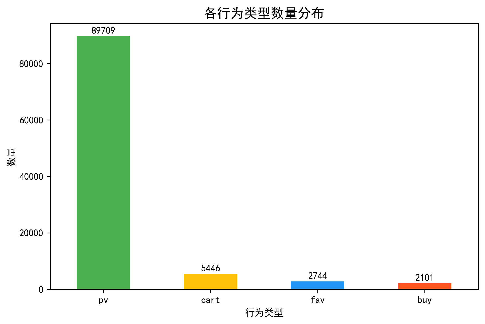
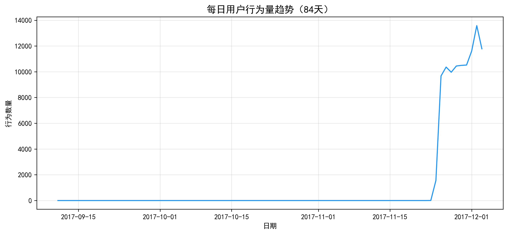
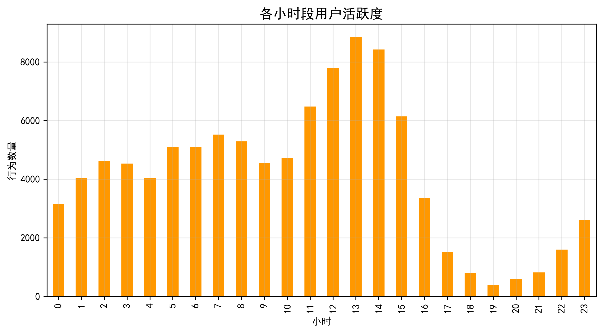
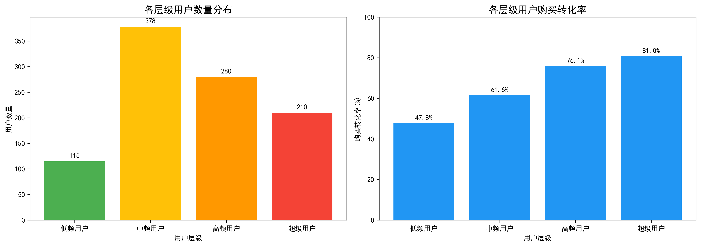

# ecommerce-user-analysis
电商用户行为数据分析项目
# 电商用户行为数据分析

## 项目简介
本项目基于阿里天池公开数据集，对10万+条用户行为记录（浏览、收藏、加购、支付）进行深度分析，旨在探索用户消费习惯与转化规律。

## 技术栈
- **数据处理**：Python (Pandas, NumPy)
- **数据查询**：SQL (SQLite)
- **可视化**：Tableau / Matplotlib

## 项目结构
- `/data`：原始数据集（来源：阿里天池）
- `/notebooks`：Jupyter Notebook 分析脚本
- `/sql`：SQL 查询语句
- `/reports`：分析报告与可视化看板截图

## 当前进度
- [x] 数据下载与初步探索
- [x] 数据清洗（处理空值、格式转换）
- [x] 用户行为特征工程
- [x] 可视化看板搭建
- [x] 分析报告
## 分析图表展示

### 用户行为分布

### 每日活跃趋势

### 各小时段活跃度

### 用户分层分析

## 📊 核心分析结论

### 1. 用户行为分布
- 用户行为中，**浏览（pv）占比最高（约89.7%）**，购买（buy）占比约2.1%
- 用户行为漏斗：浏览 → 加购 → 购买，**加购→购买转化率达92.81%**

### 2. 用户活跃度分层
- 用户分为四层：低频（11.7%）、中频（38.5%）、高频（28.5%）、超级用户（21.4%）
- **超级用户购买转化率达80.95%**，是低频用户的1.7倍
- 超级用户人均行为次数（242次）是普通用户（64次）的**3.8倍**

### 3. 时间规律
- 每日活跃趋势平稳，周末略有上升
- **用户活跃高峰集中在晚上21-23点**，可针对该时段推送促销活动

### 4. 业务建议
1. 针对**低频用户**设计“7天打卡”活动，引导向中高频转化
2. 针对**超级用户**提供专属VIP权益，巩固核心用户群体
3. 在**晚上21-23点高峰期**增加限时秒杀活动，提升转化
## 联系方式
- GitHub：xuejiayao-data
- 邮箱：joya_xue@163.com
